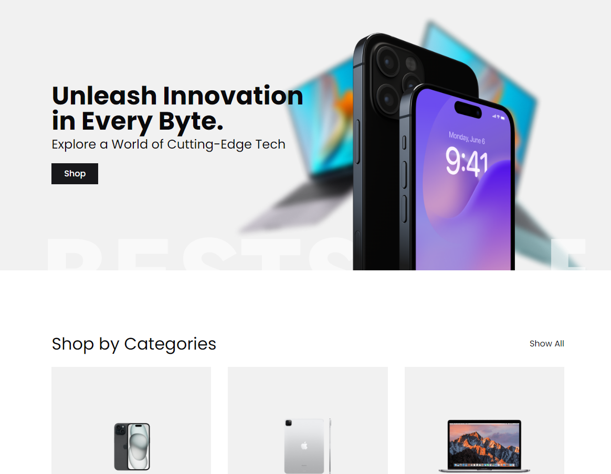
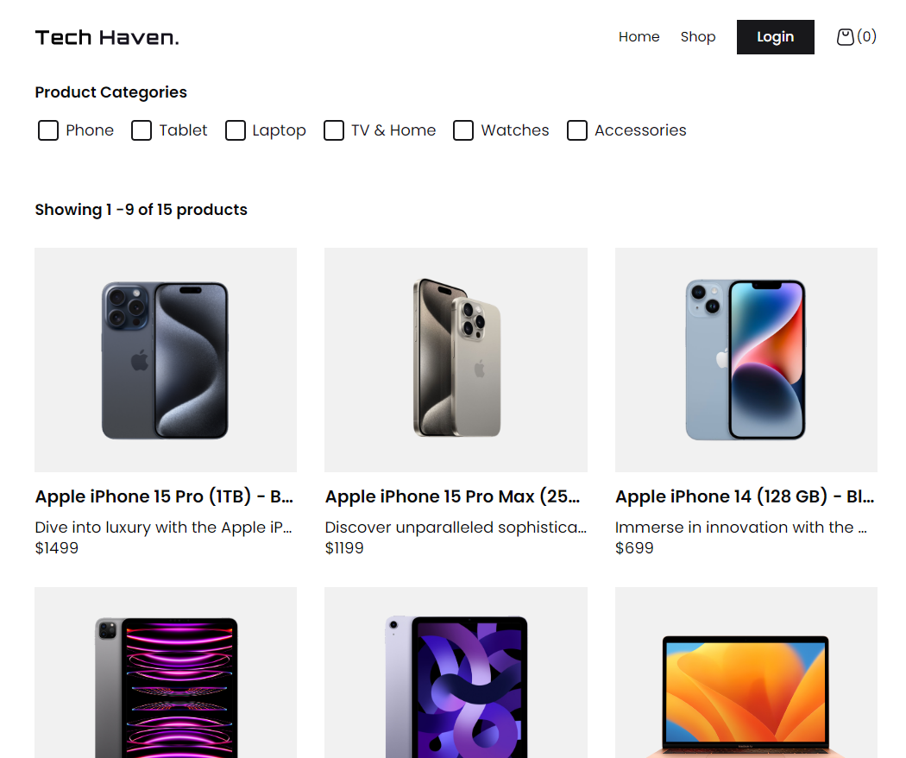
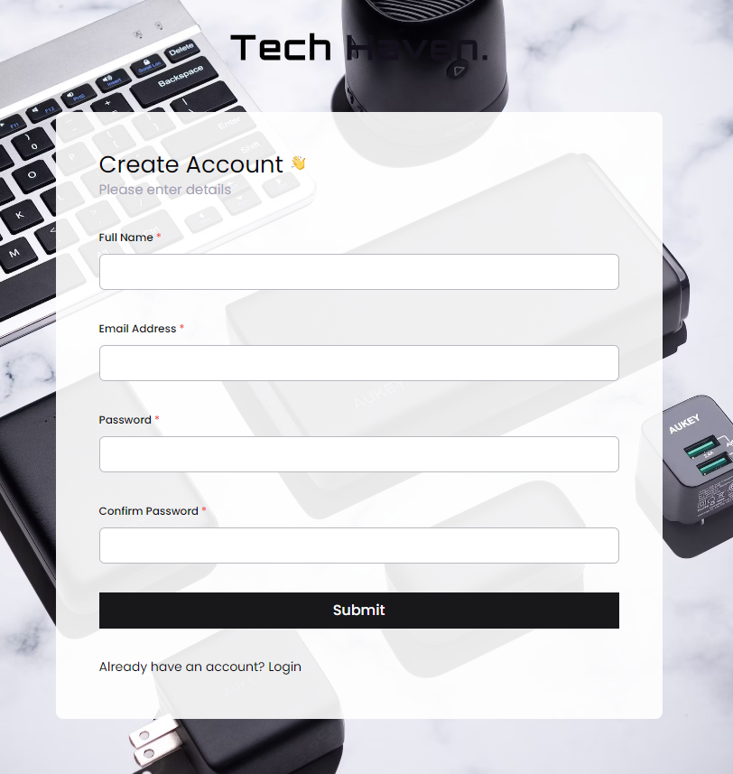

# Title

Mern Stack Ecommerce Application

## Demo:

Access my site at [ecommerce-hp0098v1.liara.run](https://ecommerce-hp0098v1.liara.run/)

## Table Of Contents:

- [About](#about-the-app)
- [Technologies](#technologies)
- [Setup](#setup)
- [Screenshots](#screenshots)

## Aboout The App:

An ecommerce app with mern stack technology.
With features in front-end like products page with filtering based on category, user cart, login and register page and etc.
And features in back-end like jwt auth with refresh token and http-only access, get products with pagination and filter based on category and etc.

## Technologies

Frontend: `React js`, `Typescript`, `React Query`, `Zustand`, `React Hook Form`, `Zod`

Backend: `Nodejs`, `Express`, `Mongoose`, `Multer`, `Joi`

Styling lib's: `Shadcn`, `Tailwindcss`

## Setup

- Download or clone repository
- run command `npm install` in client and server foldres
- add env variables in client and server foldres

### Client Env

```js
VITE_APP_API_URL = "Your Backend API URL";
VITE_APP_IMAGES_BASE_URL = "Your Backend Images Base URL (Same as API URL)";
```

### Server Env

```js
PORT = 3000;
FRONTEND_URL = "Your Frontend application URL";
DATABASE_URI = "Your Mongo DB URI";
SECRET_KEY = "Secret Key For JWT";
```

- run command `npm run dev` client and server foldres

## Screenshots




